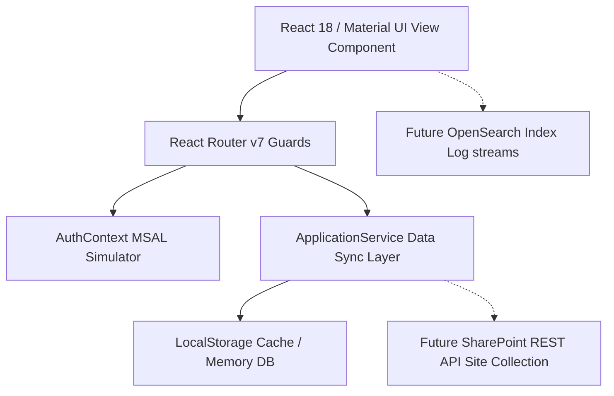

# Architectural Specifications — Application Hub

This document specifies the technical design, architectural patterns, and integrations layout backing the Application Hub.

---

## 🏗️ System Architecture

The frontend uses a decoupled service architecture separating views from persistence logic. This makes it easy to swap mock telemetry data and inventory storage without redesigning UI components.

---

## 🛣️ Routing Structure

Core navigation rules are declared in `src/routes/AppRoutes.tsx` using React Router v7:
- `/login`: Public login gateway displaying Entra Microsoft SSO prompts.
- `/ms-login`: Clean, standalone choice window used in simulated authentication popups.
- `/`: Master dashboard layout shell (`DashboardShell.tsx`). Protected via `AuthContext` guards redirecting unauthenticated users to `/login`.
  - `/dashboard`: High-level counts widgets and recent action audit logs.
  - `/applications`: Toggleable Card/Table catalog listing and filters.
  - `/applications/:id`: Application detail tabs view.
  - `/register`: Stepper-based multi-step registration forms.
  - `/insights`: SVG visualizations tracking tech stacks and BU metrics.
  - `/settings`: Configurations sandbox.

---

## 🔒 Authentication Context & MSAL Integration

SSO authentication is managed via `src/context/AuthContext.tsx`:
1. **SSO Handshake**: Clicking "Sign in with Microsoft" opens a popup window `/ms-login`.
2. **PostMessage Callback**: Once the user chooses a profile and submits in the popup, the popup calls `window.opener.postMessage(payload)` containing user claims and calls `window.close()`.
3. **Session Cache**: The parent window captures the event listener, verifies origin security, sets user context in React State, and stores it in `localStorage` under `app_hub_user_session` to bypass redirects on page reloads.
4. **MSAL Migration Plan**: To move to Microsoft MSAL:
   - Replace the simulated login popup with `@azure/msal-react` and `@azure/msal-browser` providers.
   - Replace local storage hooks with MSAL token acquisitions calls inside the `login` trigger.

---

## 🗄️ Service Sync Layer & SharePoint Migration

To isolate business logic, all applications mutations are wrapped in `src/services/ApplicationService.ts`:
- Emits CRUD actions via standard async Promises (`Promise<Application>`).
- Logs history timelines (e.g. status changes, version bumps) automatically during updates.
- Persists changes locally in `localStorage` under the key `app_hub_inventory_data` to ensure a consistent experience across restarts.

### SharePoint Online Integration Blueprint
To replace the mock backend with SharePoint list endpoints:
1. Enable the SharePoint Client Credentials flow or Azure AD application registration delegated access scopes.
2. In `ApplicationService.ts`, import standard axios/fetch clients pointing to the target site.
3. Translate SharePoint REST API queries to match the `Application` TypeScript schema:
   - **GET** `/_api/web/lists/getbytitle('ApplicationInventoryList')/items` returns the application inventory items.
   - **POST** requests are sent to create or modify items.
4. Token handshakes can be fetched directly using the client secret and tenant ID configured in the **SharePoint Settings** tab of the portal.

---

## 📊 OpenSearch Telemetry Integration

For applications that have telemetry enabled, the **Telemetry Details** tab displays latency charts and OpenSearch indexing details.
- **Log Indexing**: Matches index strings configured inside registration schemas (e.g. `logstash-sp-sync-*`).
- **Telemetry Swapping**: Components query OpenSearch endpoints (or an proxy API Gateway endpoint) using the registered `serviceName` to return availability, response time, and errors count.
