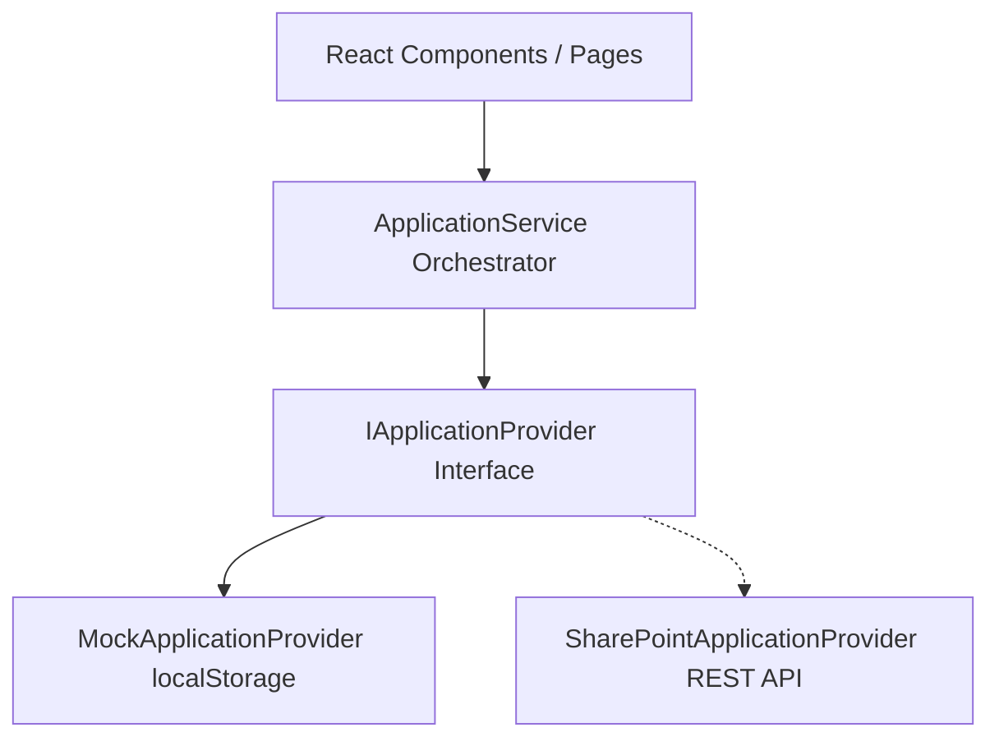

# Technical Design Document (TDD) — Application Hub

This document details the software design, design patterns, state management, and key code APIs backing the Application Hub.

---

## 🏗️ Architectural Overview

Application Hub uses a **decoupled service-provider architecture** to isolate frontend React views from data persistence layers. This separation ensures that the application can transition from a simulated sandbox environment to a real production environment with minimal effort.

---

## 🗄️ Persistence Layer Design (Provider Pattern)

The data access layer utilizes the **Provider Design Pattern**:
1. **Contract**: The interface `IApplicationProvider` defines standard asynchronous methods:
   - `getApplications(): Promise<Application[]>`
   - `getApplicationById(id: string): Promise<Application | null>`
   - `createApplication(app: Omit<Application, 'id' | 'createdAt' | 'lastUpdated'>): Promise<Application>`
   - `updateApplication(app: Application): Promise<Application>`
2. **Mock Implementation**: `MockApplicationProvider` stores application records in `localStorage` to persist data between page refreshes.
3. **SharePoint Provider**: `SharePointApplicationProvider` serves as a placeholder containing structural requirements for connecting to Microsoft Lists.
4. **Service Orchestration**: `ApplicationService` handles data fetching and updates. It exposes direct static methods to React pages, dispatching requests to the active provider.

---

## 🔒 Session & Authentication Architecture

Authentication is managed via a React Context (`AuthContext.tsx`) and hooks:
- **SSO Handshake**: Clicking "Sign In with Microsoft" opens a popup window pointing to `/ms-login`.
- **Cross-Window Messaging**: The popup communicates successful authentication events back to the parent window using the browser's `postMessage` API.
- **Session Caching**: User profiles and mock tokens are stored in `localStorage` to maintain authentication states across page reloads.

---

## 🎨 Theme & Styling System

The application styling is built on a customized Material UI theme:
- **Tokens**: Custom palettes (Violet brand color and Cyan highlight color) are defined in `src/shared/theme/theme.ts`.
- **Glassmorphism**: Visual accents (mesh background overlays, backdrop blurs, and border outlines) are declared in `src/index.css`.
- **Layouts**: Standardised layouts (header navigation, collapsible sidebar, and global search dialogs) are housed in `src/shared/layouts/`.
- **Responsive Grids**: All grids utilize Material UI's modern `Grid` layout component with size attributes (e.g. `size={{ xs: 12, sm: 6 }}`).
